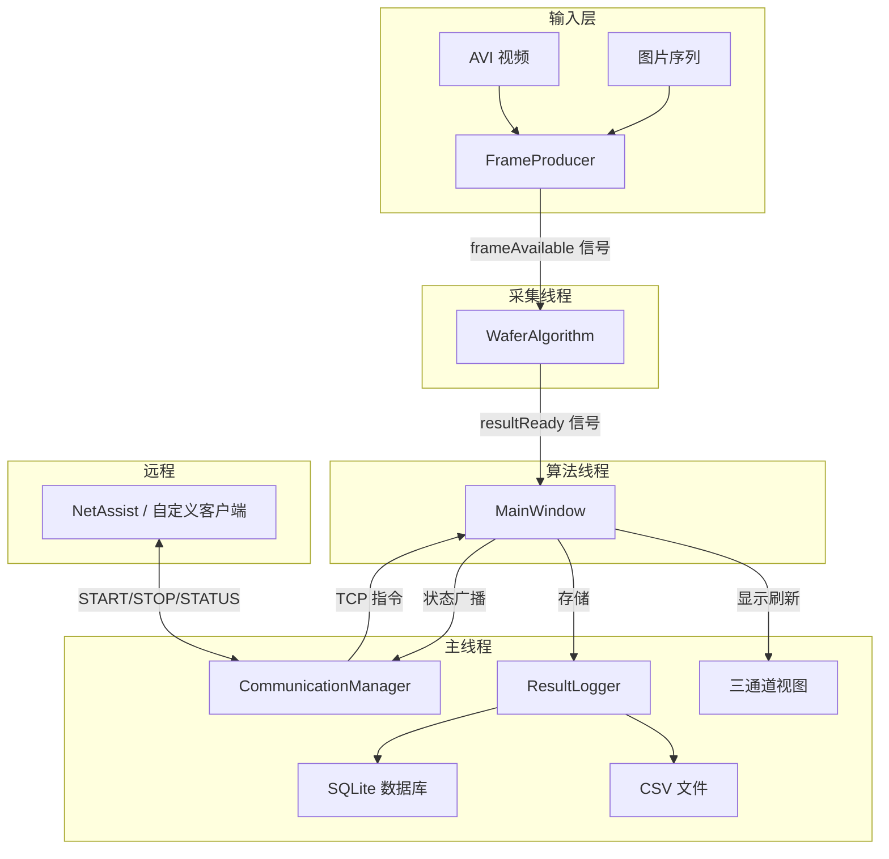

# WaferMaster — 晶圆平坦度智能检测系统

基于 **OpenCV + Qt 6** 的晶圆（Wafer）表面平坦度检测桌面应用，支持 AVI 视频 / 图片序列输入，实时傅里叶频谱分析，自动判定良品/警告/不合格，并提供 TCP 远程控制接口。

<p align="center">
  
  
  
  
  
  
</p>

---

## 功能特性

- **多输入源支持**：AVI 视频文件 或 图片序列文件夹，可配置帧间隔模拟帧率
- **核心检测算法**：灰度化 → 极坐标变换 → DFT → 圆环带通滤波 → IDFT → 三指标判定
  - **FI**（平坦度指标）：频谱能量分布均匀性
  - **p95**：热区像素强度阈值
  - **HotRatio**：热区像素占比
- **三级判定**：🟢 Good（良品）/ 🟡 Warning（警告）/ 🔴 NG（不合格）
- **三通道可视化**：原图 + 频谱图 + 平坦度图 实时同步显示
- **观察 ROI**：在原图上鼠标框选任意区域，弹窗查看 ROI 原图和平坦图细节
- **双写存储**：CSV（人可读）+ SQLite（结构化查询），支持按检测等级筛选历史记录
- **TCP 远程控制**：内置 TCP Server，可通过 NetAssist 等工具发送 `START` / `STOP` / `STATUS` 指令
- **自适应缩放**：窗口全屏/恢复时图像自动适配
- **实时日志**：spdlog 日志系统，同时输出到文件和控制台面板

---

## 截图概览


---

## 技术栈

| 组件 | 版本 | 用途 |
|------|------|------|
| C++ | 17 | 核心语言标准 |
| Qt 6 | 6.10.2 (msvc2022_64) | GUI 框架 + 网络 + SQL |
| OpenCV | 4.12.0 | 图像处理与频域分析 |
| spdlog | 1.14.1 | 高性能异步日志 |
| SQLite | 3 (via Qt SQL) | 检测结果持久化 |
| CMake | 3.20+ | 跨平台构建系统 |
| MSVC | 2022 | Windows 编译器 |

---

## 项目结构

```
WaferMaster/
├── CMakeLists.txt              # CMake 构建配置
├── CMakePresets.json           # CMake 预设（Debug/Release）
├── .gitignore
├── include/
│   ├── Common.h                # 枚举、配置结构体、结果载体
│   ├── MainWindow.h            # 主窗口（线程编排、UI 刷新）
│   ├── WaferAlgorithm.h        # 核心算法（频域平坦度检测）
│   ├── FrameProducer.h         # 采集层（AVI/图片序列→帧队列）
│   ├── CommunicationManager.h  # TCP 通信管理（远程控制）
│   ├── ResultLogger.h          # 持久化存储（CSV + SQLite）
│   ├── RoiViewerDialog.h       # 观察 ROI 弹窗
│   └── Logger.h                # spdlog 封装
├── src/                        # 源文件实现
│   ├── main.cpp
│   ├── MainWindow.cpp
│   ├── WaferAlgorithm.cpp
│   ├── FrameProducer.cpp
│   ├── CommunicationManager.cpp
│   ├── ResultLogger.cpp
│   └── RoiViewerDialog.cpp
├── ui/
│   └── WaferMaster.ui          # Qt Designer UI 布局
├── resources/
│   ├── app.rc                  # Windows 资源文件
│   └── resources.qrc           # Qt 资源集合
└── spdlog/                     # spdlog 源码（v1.14.1，静态链接）
```

---

## 架构设计



**线程模型**：采集和算法各自运行在独立 `QThread`，通过信号槽跨线程通信，`cv::Mat` 使用 `clone()` 确保数据独立。

---

## 算法流程

```
输入帧 → 灰度化 → warpPolar 极坐标展开
         → DFT 傅里叶变换 → shiftDFT 频谱中心化
         → 圆环带通掩膜（滤除低频DC + 高频噪声）
         → IDFT 逆变换 → 中心 ROI 裁切
         → 计算 FI / p95 / HotRatio
         → classify() 判定 Good / Warning / NG
```

---

## 通信协议

基于纯文本 TCP，每行一条指令（UTF-8），默认端口 `9000`。

| 指令 | 功能 | 响应 |
|------|------|------|
| `START` | 远程启动检测 | `OK STARTED` |
| `STOP` | 远程停止检测 | `OK STOPPED` |
| `STATUS` | 查询当前状态 | `STATUS Idle/Running/Stopped/Error` + 最近结果 |

---

## 构建指南

### 前置依赖

1. **Visual Studio 2022**（含 MSVC v143 工具链）
2. **Qt 6.10.2**（msvc2022_64），安装路径 `E:/Qt/6.10.2/msvc2022_64`
3. **OpenCV 4.12.0**，安装路径 `D:/opencv/opencv/build`
4. **CMake 3.20+**

> ⚠️ 路径不同时请修改 `CMakeLists.txt` 中的 `CMAKE_PREFIX_PATH` 和 `OpenCV_DIR`。

### 编译

```bash
# 配置（Release）
cmake -B build -S . -DCMAKE_BUILD_TYPE=Release

# 构建
cmake --build build --config Release
```

生成的 `WaferMaster.exe` 位于 `build/Release/`。

### 打包发布（免安装绿色版）

```bash
# 1. 创建发布目录 & 复制 exe
mkdir WaferMaster_Release_v1.0
copy build\Release\WaferMaster.exe WaferMaster_Release_v1.0\

# 2. Qt 依赖脱壳
windeployqt WaferMaster_Release_v1.0\WaferMaster.exe --release --no-translations

# 3. 复制 OpenCV dll
copy D:\opencv\opencv\build\x64\vc16\bin\opencv_world4120.dll WaferMaster_Release_v1.0\

# 4. 打包
Compress-Archive -Path WaferMaster_Release_v1.0\* -DestinationPath WaferMaster_v1.0.zip
```

目标机器需安装 [VC++ 2022 运行时](https://aka.ms/vs/17/release/vc_redist.x64.exe)。

---

## License

MIT License — 仅供学习与演示用途。
